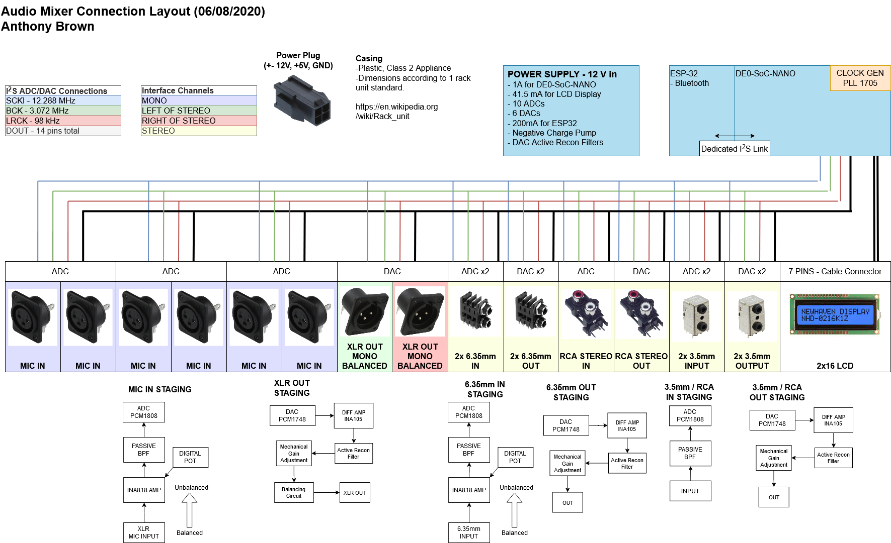
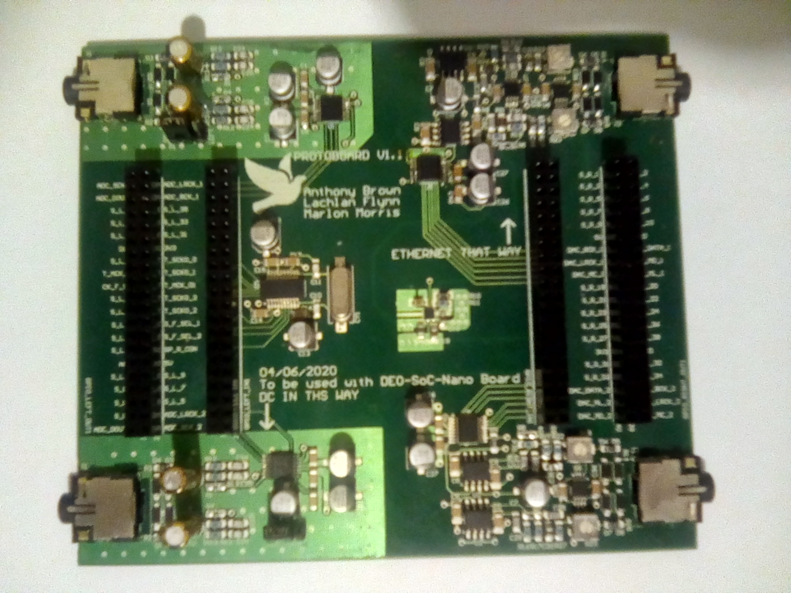

# Audio-Mixer-FPGA
This repository contains all the code project files for the industrial project I did for my final year of university.

The aim of this project was to design and manufacture an flexible general use audio mixer capable of taking in multiple 
different audio sources (3.5mm, XLR, Internet, Bluetooth, etc), mixing them together any way the user wants, and outputing 
the mixed audio signal through one or more user chosen interfaces. 

The uniqueness of this project comes from the fact the audio mixer itself has no physical buttons, knobs, or sliders to
control how the audio is mixed. The mixer is controlled purely through a USB or remote connection, such as Bluetooth 
or an Ethernet Connection. A C# GUI is used to control all functions of the mixer, in a way that makes it controllable 
from anywhere.

The audio mixing itself is done by the DE0-SoC-Nano development board, supporting the Cyclone V, 
a chip that is a combination of both an FPGA and a ARM Cortex A9 processor. The FPGA is used for lower 
level tasks like audio mixing, while the processor is used for higher level tasks, such as running Linux 
and a TCP/IP stack for transfering audio over the internet.

A prototype audio mixing board was design and produced to test the core components of the audio mixer. The PCB shown above 
supports two 3.5mm audio input jacks, two 3.5mm audio output jacks, and a set of headers to connect the FPGA development board.

Unfortunately due to running out of time and budget, the final board was never manufactured.
